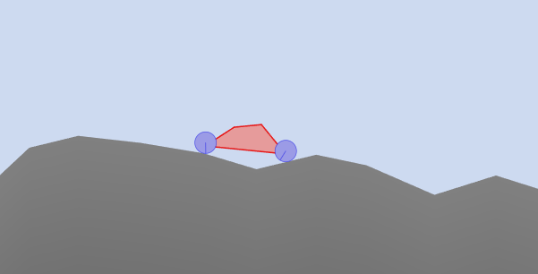
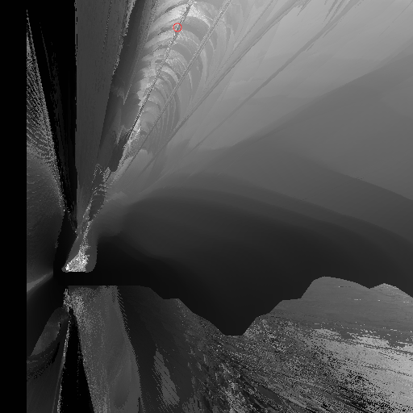

# Genetic Algorithm 2D Car Thing

## About the project

An experimental project for visualizing certain solution spaces and for seeing how a genetic algorithm traverses them.

## How it works

A car is simulated driving on a terrain in a 2D environment. You can choose how many parameters of the car you want the genetic algorithm to try to optimize (or to brute-force). If you choose exactly two parameters you will see a 2D texture show up whose pixels represent every solution in the solution space. The X and Y coordinates of each pixel represents the two parameters you selected, and the color of each pixel represents the fitness of each solution. If you choose to brute-force all possible solutions, every pixel in the texture will receive a value and you will see the entire solution space visualized. When you start the genetic algorithm, you can see how it moves around the solution space looking for the best solution.

Fitness score is determined by how far the car is able to drive in a certain amount of time.

## Features

- Two types of vehicles:
  - Triangle Joint Car
  - Fixture Box Car
- Multiple terrain types
- You can select up to 19 parameters to optimize.
- You can modify the min/max range of every parameter.
- The genetic algorithm is configurable.
- Can visualize the solution space of any 2 parameters you choose (by brute-forcing all possible configurations)
- Supports saving and loading settings

## Gallery

|  | 
|:--:| 
| *A fixture box car.* |

|  | 
|:--:| 
| *The solution space of two parameters (X and Y position of the chassis) have been visualized (seen in the black and white texture to the left). The texture portrays the fitness scores of every possible car configuration. You can use your cursor to select a car configuration from this texture, and see how well the car performs.* |

|  | 
|:--:| 
| *This is a visualization of another solution space. The two parameters that are visualized are the X and Y position of the chassis for a triangle joint car. I used a large parameter range which caused the solution space to look "zoomed out". This allows you to see the terrain itself inside the solution space.* |

[Solution spaces can look quite interesting when visualized, here are more examples.](images/interesting-solution-spaces)

## Build

### Minimum requirements

- Windows 10 (version 1909 or later)
- A shader model 6.6 capable graphics card and graphics drivers
- CMake 3.22 or higher

### Windows

Follow these steps to build this project on Windows.

1. Download [nuget.exe](https://learn.microsoft.com/en-us/nuget/install-nuget-client-tools?tabs=windows#nugetexe-cli).

2. Add `nuget.exe` to your system's environment PATH.

3. Run `build.cmd` to generate Visual Studio 2019 project files using CMake. The generated project files will appear in a folder named `build`.
   - **Note**: An internet connection is required during this step for NuGet to download Agility SDK (required for D3D12). The Agility SDK package will also be placed in the `build` folder.
   - **Other IDEs**: The `build.cmd` script builds for Visual Studio 2019. If you want to build for another IDE, run CMake commands manually to generate project files for your chosen IDE. Note that the compatibility with IDEs other than Visual Studio is not guaranteed, as this is the only IDE tested so far.

4. After the script completes, it will automatically open the Visual Studio solution file. From there, you can build and run the project.

## Third Party Libraries

- [iglo](https://github.com/c-chiniquy/iglo)
- [Box2D](https://github.com/erincatto/box2d)
- [ImGui](https://github.com/ocornut/imgui)
- [ImPlot](https://github.com/epezent/implot)
- [ini.h](https://github.com/mattiasgustavsson/libs/blob/main/ini.h)

